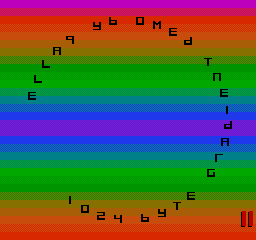

# nes-gradient
A demo for the [NES](https://en.wikipedia.org/wiki/Nintendo_Entertainment_System). Shows an animated gradient and moving text. Warning: you may get a seizure.

Table of contents:
* [List of files](#list-of-files)
* [Technical info](#technical-info)

## List of files
* `gradient.asm`: source code (assembles with [ASM6](https://github.com/qalle2/asm6))
* `gradient.nes.gz`: assembled program (iNES format, gzip compressed)
* `assemble.sh`: a Linux script that assembles the program (warning: deletes files)
* `hexdump.py`: creates `hexdump.txt`
* `hexdump.txt`: assembled program in hexadecimal
* `snap.png`: screenshot

## Technical info
* mapper: NROM
* PRG ROM: 16 KiB (only 1 KiB is actually used)
* CHR ROM: none (uses CHR RAM)
* name table mirroring: vertical
* compatibility: NTSC and PAL
